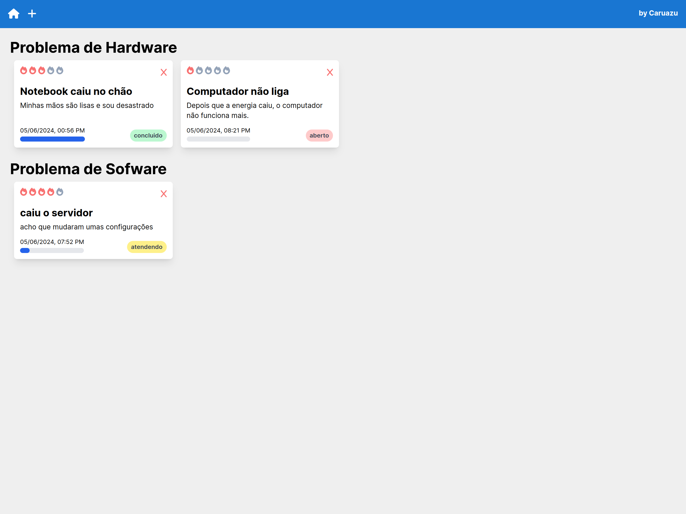
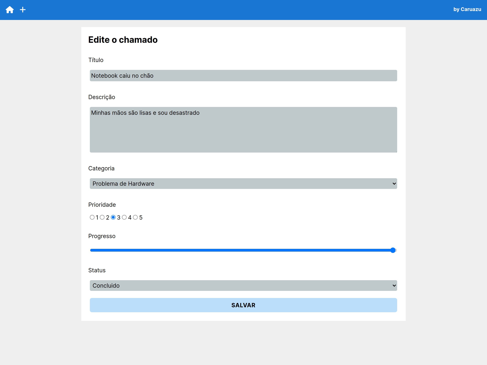
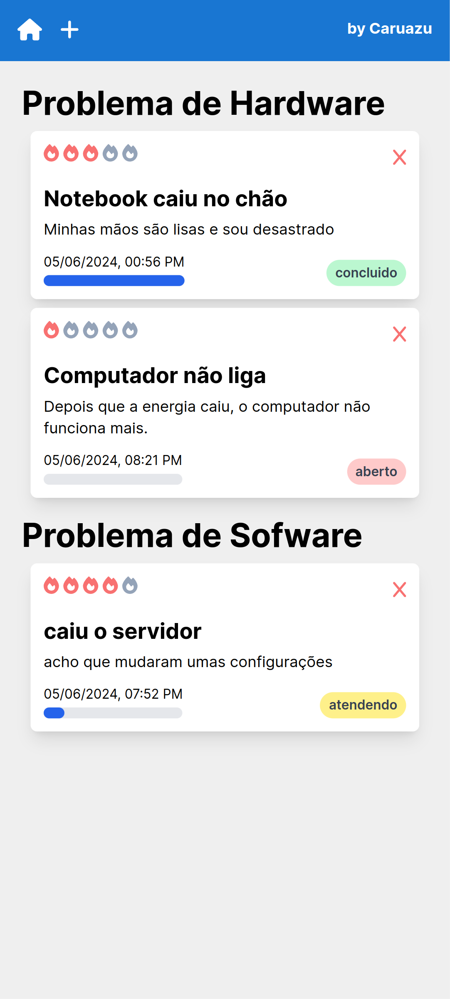
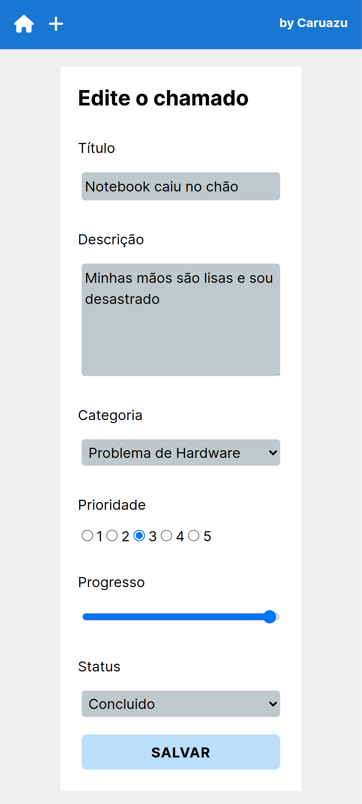

# Chamados


## Sobre

> Um aplicativo para gerenciar um setor de suporte em TI.

Este projeto foi criado em um único dia para mostrar meus conhecimentos básicos com as tecnologias usadas. Não há intenção de utilizar esse código em qualquer aplicação comercial, e nem em futuras manutenções.

## Instalação

### Dependências

Esta aplicação foi construída com:

- linux kernel: 5.15
- linux Mint: 21
- node.js: 20
- npm: 10

O restante das dependências são gerenciadas pelo `npm`.

### Configuração

Utilize o arquivo `LOCAL.env.local` como exemplo para suas variáveis locais. Faça sua cópia do arquivo e altere o nome deste para `env.local`, ponha os dados de sua implementação. 

### Inicialização

```bash
npm install
```

```bash
npm run build
```

```bash
npm run start
```

## Implementação

Esse projeto foi disponibilizado via [Vercel](https://vercel.com/) e [MongoDB Atlas](https://www.mongodb.com/products/platform/cloud). Seu demo está disponível [aqui](https://chamados-lime.vercel.app/).

## Imagens das telas

### Desktop




### Mobile

<p align="center">


</p>
